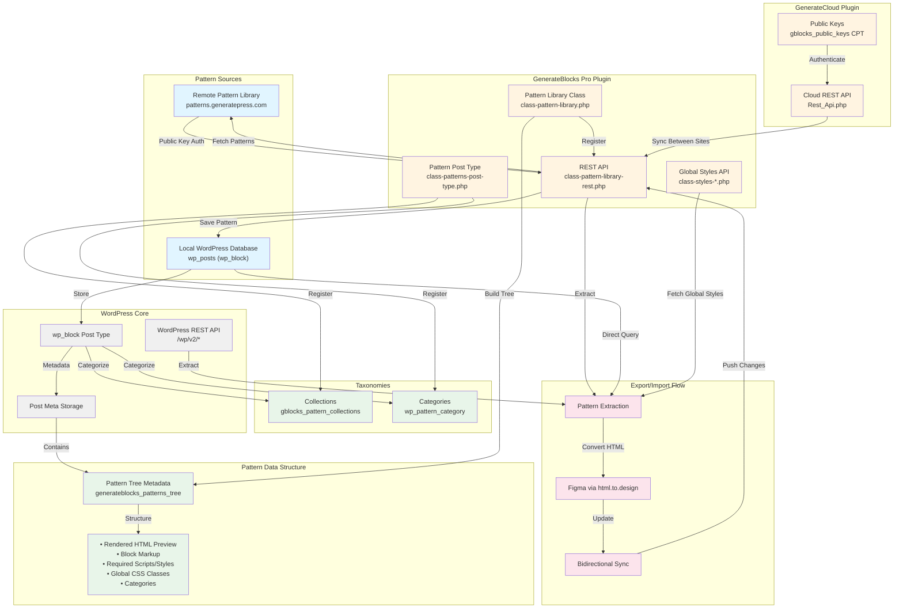
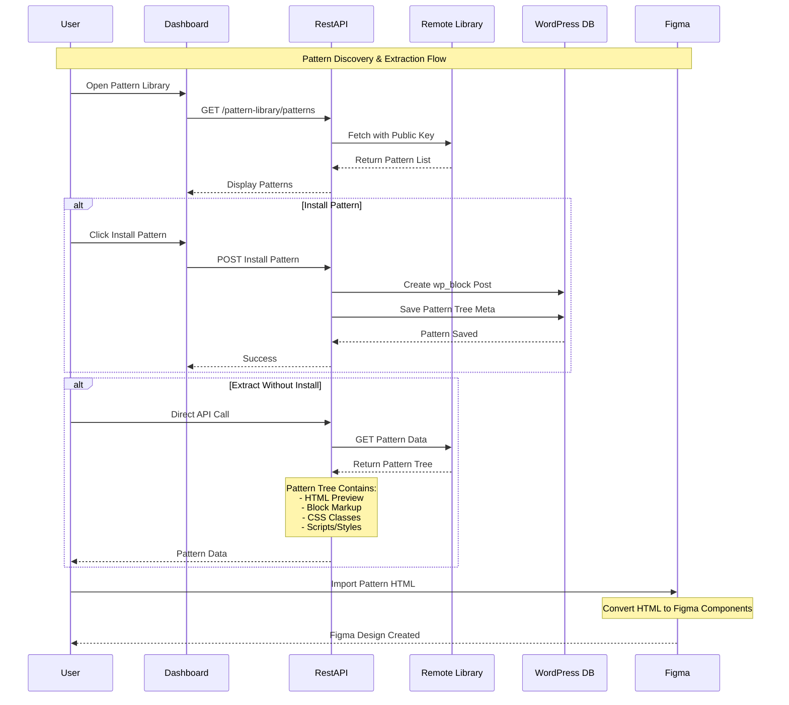
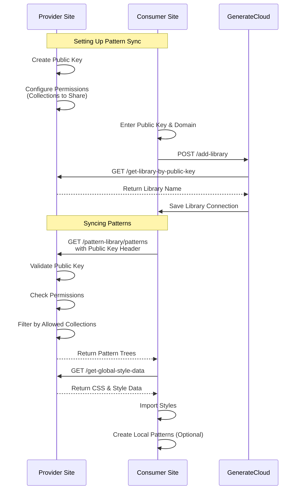
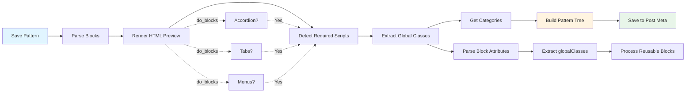
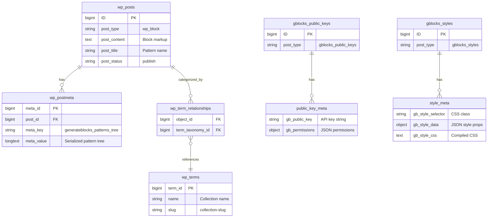

```mermaid
graph TB
    subgraph "Pattern Sources"
        Remote["Remote Pattern Library<br/>patterns.generatepress.com"]
        LocalDB["Local WordPress Database<br/>wp_posts (wp_block)"]
    end
    
    subgraph "GenerateBlocks Pro Plugin"
        PatternLib["Pattern Library Class<br/>class-pattern-library.php"]
        RestAPI["REST API<br/>class-pattern-library-rest.php"]
        PostType["Pattern Post Type<br/>class-patterns-post-type.php"]
        StylesAPI["Global Styles API<br/>class-styles-*.php"]
    end
    
    subgraph "GenerateCloud Plugin"
        PublicKeys["Public Keys<br/>gblocks_public_keys CPT"]
        CloudRest["Cloud REST API<br/>Rest_Api.php"]
    end
    
    subgraph "WordPress Core"
        WPRest["WordPress REST API<br/>/wp/v2/*"]
        WPBlocks["wp_block Post Type"]
        WPMeta["Post Meta Storage"]
    end
    
    subgraph "Pattern Data Structure"
        PatternTree["Pattern Tree Metadata<br/>generateblocks_patterns_tree"]
        TreeContent["• Rendered HTML Preview<br/>• Block Markup<br/>• Required Scripts/Styles<br/>• Global CSS Classes<br/>• Categories"]
    end
    
    subgraph "Taxonomies"
        Collections["Collections<br/>gblocks_pattern_collections"]
        Categories["Categories<br/>wp_pattern_category"]
    end
    
    subgraph "Export/Import Flow"
        Extract["Pattern Extraction"]
        Figma["Figma via html.to.design"]
        Sync["Bidirectional Sync"]
    end
    
    %% Connections
    Remote -->|Public Key Auth| RestAPI
    RestAPI -->|Fetch Patterns| Remote
    RestAPI -->|Save Pattern| LocalDB
    LocalDB -->|Store| WPBlocks
    WPBlocks -->|Metadata| WPMeta
    WPMeta -->|Contains| PatternTree
    PatternTree -->|Structure| TreeContent
    
    PatternLib -->|Register| RestAPI
    PatternLib -->|Build Tree| PatternTree
    PostType -->|Register| Collections
    PostType -->|Register| Categories
    
    PublicKeys -->|Authenticate| CloudRest
    CloudRest -->|Sync Between Sites| RestAPI
    
    WPBlocks -->|Categorize| Collections
    WPBlocks -->|Categorize| Categories
    
    RestAPI -->|Extract| Extract
    WPRest -->|Extract| Extract
    LocalDB -->|Direct Query| Extract
    Extract -->|Convert HTML| Figma
    Figma -->|Update| Sync
    Sync -->|Push Changes| RestAPI
    
    StylesAPI -->|Fetch Global Styles| Extract
    
    classDef source fill:#e1f5ff
    classDef plugin fill:#fff4e1
    classDef core fill:#f0f0f0
    classDef data fill:#e8f5e9
    classDef export fill:#fce4ec
    
    class Remote,LocalDB source
    class PatternLib,RestAPI,PostType,StylesAPI,PublicKeys,CloudRest plugin
    class WPRest,WPBlocks,WPMeta core
    class PatternTree,TreeContent,Collections,Categories data
    class Extract,Figma,Sync export
```

# Pattern Flow Diagram

```mermaid
sequenceDiagram
    participant User
    participant Dashboard
    participant RestAPI
    participant Remote as Remote Library
    participant LocalDB as WordPress DB
    participant Figma
    
    Note over User,Figma: Pattern Discovery & Extraction Flow
    
    User->>Dashboard: Open Pattern Library
    Dashboard->>RestAPI: GET /pattern-library/patterns
    RestAPI->>Remote: Fetch with Public Key
    Remote-->>RestAPI: Return Pattern List
    RestAPI-->>Dashboard: Display Patterns
    
    alt Install Pattern
        User->>Dashboard: Click Install Pattern
        Dashboard->>RestAPI: POST Install Pattern
        RestAPI->>LocalDB: Create wp_block Post
        RestAPI->>LocalDB: Save Pattern Tree Meta
        LocalDB-->>RestAPI: Pattern Saved
        RestAPI-->>Dashboard: Success
    end
    
    alt Extract Without Install
        User->>RestAPI: Direct API Call
        RestAPI->>Remote: GET Pattern Data
        Remote-->>RestAPI: Return Pattern Tree
        Note over RestAPI: Pattern Tree Contains:<br/>- HTML Preview<br/>- Block Markup<br/>- CSS Classes<br/>- Scripts/Styles
        RestAPI-->>User: Pattern Data
    end
    
    User->>Figma: Import Pattern HTML
    Note over Figma: Convert HTML to Figma Components
    Figma-->>User: Figma Design Created
```

# Cloud Sync Flow

```mermaid
sequenceDiagram
    participant Provider as Provider Site
    participant Consumer as Consumer Site
    participant Cloud as GenerateCloud
    
    Note over Provider,Consumer: Setting Up Pattern Sync
    
    Provider->>Provider: Create Public Key
    Provider->>Provider: Configure Permissions<br/>(Collections to Share)
    
    Consumer->>Consumer: Enter Public Key & Domain
    Consumer->>Cloud: POST /add-library
    Cloud->>Provider: GET /get-library-by-public-key
    Provider-->>Cloud: Return Library Name
    Cloud->>Consumer: Save Library Connection
    
    Note over Provider,Consumer: Syncing Patterns
    
    Consumer->>Provider: GET /pattern-library/patterns<br/>with Public Key Header
    Provider->>Provider: Validate Public Key
    Provider->>Provider: Check Permissions
    Provider->>Provider: Filter by Allowed Collections
    Provider-->>Consumer: Return Pattern Trees
    
    Consumer->>Provider: GET /get-global-style-data
    Provider-->>Consumer: Return CSS & Style Data
    
    Consumer->>Consumer: Import Styles
    Consumer->>Consumer: Create Local Patterns (Optional)
```

# Pattern Tree Generation Flow

```mermaid
graph LR
    A[Save Pattern] --> B[Parse Blocks]
    B --> C[Render HTML Preview]
    C --> D[Detect Required Scripts]
    D --> E[Extract Global Classes]
    E --> F[Get Categories]
    F --> G[Build Pattern Tree]
    G --> H[Save to Post Meta]
    
    C -.->|do_blocks| C1[Accordion?]
    C1 -.->|Yes| D
    C -.->|do_blocks| C2[Tabs?]
    C2 -.->|Yes| D
    C -.->|do_blocks| C3[Menus?]
    C3 -.->|Yes| D
    
    E --> E1[Parse Block Attributes]
    E1 --> E2[Extract globalClasses]
    E2 --> E3[Process Reusable Blocks]
    
    style A fill:#e1f5ff
    style H fill:#e8f5e9
    style G fill:#fff4e1
```

# Data Model

```mermaid
erDiagram
    wp_posts ||--o{ wp_postmeta : has
    wp_posts ||--o{ wp_term_relationships : categorized_by
    wp_term_relationships }o--|| wp_terms : references
    
    wp_posts {
        bigint ID PK
        string post_type "wp_block"
        text post_content "Block markup"
        string post_title "Pattern name"
        string post_status "publish"
    }
    
    wp_postmeta {
        bigint meta_id PK
        bigint post_id FK
        string meta_key "generateblocks_patterns_tree"
        longtext meta_value "Serialized pattern tree"
    }
    
    wp_terms {
        bigint term_id PK
        string name "Collection name"
        string slug "collection-slug"
    }
    
    wp_term_relationships {
        bigint object_id FK
        bigint term_taxonomy_id FK
    }
    
    gblocks_public_keys {
        bigint ID PK
        string post_type "gblocks_public_keys"
    }
    
    gblocks_public_keys ||--o{ public_key_meta : has
    
    public_key_meta {
        string gb_public_key "API key string"
        object gb_permissions "JSON permissions"
    }
    
    gblocks_styles {
        bigint ID PK
        string post_type "gblocks_styles"
    }
    
    gblocks_styles ||--o{ style_meta : has
    
    style_meta {
        string gb_style_selector "CSS class"
        object gb_style_data "JSON style props"
        text gb_style_css "Compiled CSS"
    }
```
